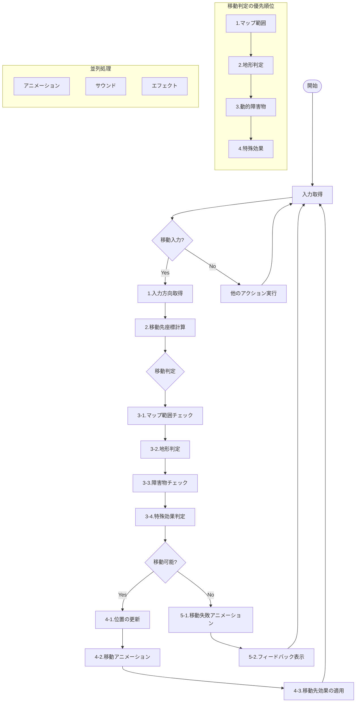

```mermaid
flowchart TD
Start([開始]) --> Input[入力取得]
Input --> IsMove{移動入力?}

    %% 移動処理フロー
    IsMove -->|Yes| GetDir[1.入力方向取得]
    GetDir --> CalcPos[2.移動先座標計算]
    CalcPos --> Validate{移動判定}

    %% 移動判定の詳細
    Validate --> CheckBounds[3-1.マップ範囲チェック]
    CheckBounds --> CheckTerrain[3-2.地形判定]
    CheckTerrain --> CheckObstacles[3-3.障害物チェック]
    CheckObstacles --> CheckEffects[3-4.特殊効果判定]

    CheckEffects --> CanMove{移動可能?}

    %% 移動成功時の処理
    CanMove -->|Yes| Move[4-1.位置の更新]
    Move --> PlayAnim[4-2.移動アニメーション]
    PlayAnim --> ApplyEffect[4-3.移動先効果の適用]
    ApplyEffect --> Input

    %% 移動失敗時の処理
    CanMove -->|No| Blocked[5-1.移動失敗アニメーション]
    Blocked --> Feedback[5-2.フィードバック表示]
    Feedback --> Input

    %% その他のアクション処理
    IsMove -->|No| Action[他のアクション実行]
    Action --> Input

    %% 注釈
    subgraph 移動判定の優先順位
        direction TB
        P1[1.マップ範囲] --> P2[2.地形判定]
        P2 --> P3[3.動的障害物]
        P3 --> P4[4.特殊効果]
    end

    subgraph 並列処理
        direction TB
        E1[アニメーション]
        E2[サウンド]
        E3[エフェクト]
    end
```
