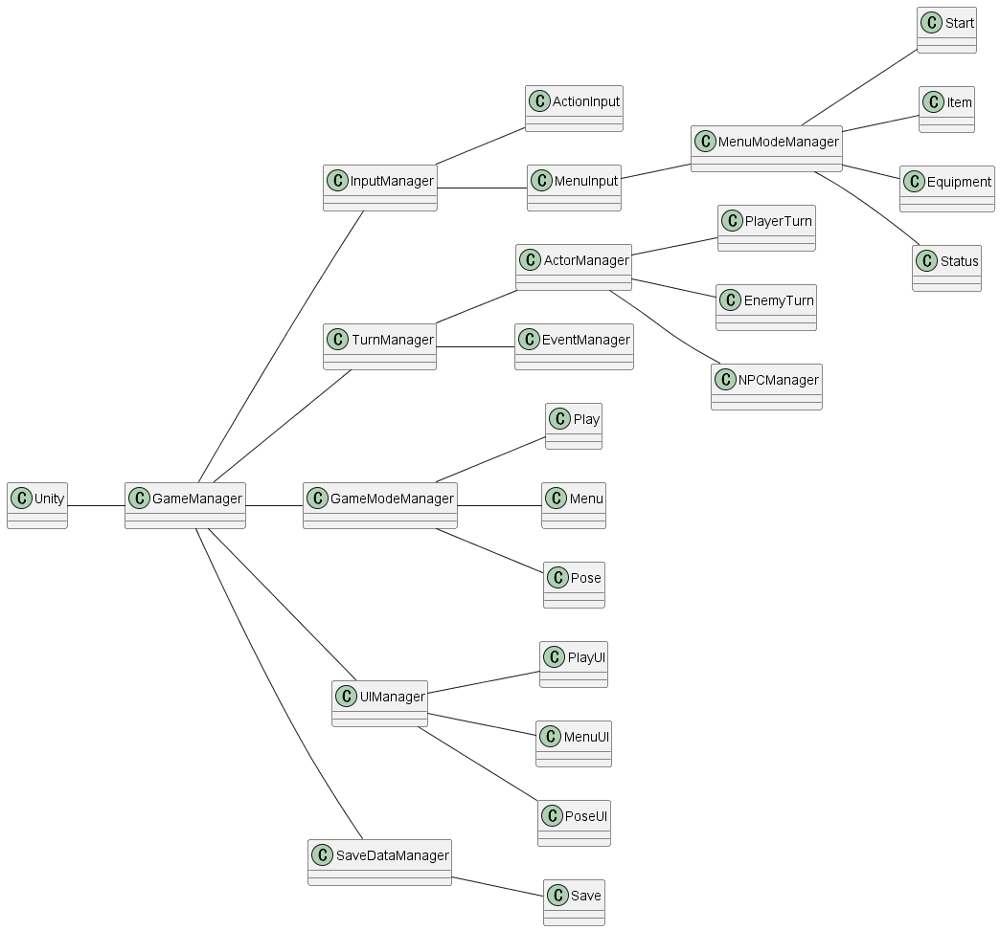

# システム設計書

## はじめに

はじめから全部盛りを作ろうとしたけどつくるもの多すぎて無理だったので分けてつくる。
本作の主な遊びは

1. 2D ローグライク
2. おさわり
3. ビジュアルノベル

なので、各部の設計を考えて、実装して、最後にがっちゃんこして終わる(終わりたい)。

## 2D ローグライク

普通にクラス設計をして、Unity とつながる部分だけ Monobehavior 化して Unity システム上で動かす設計にする。

