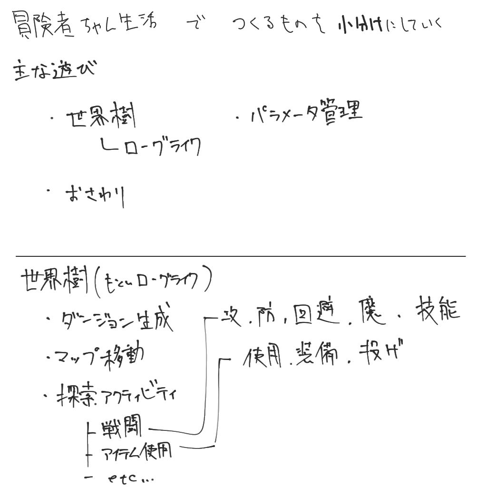
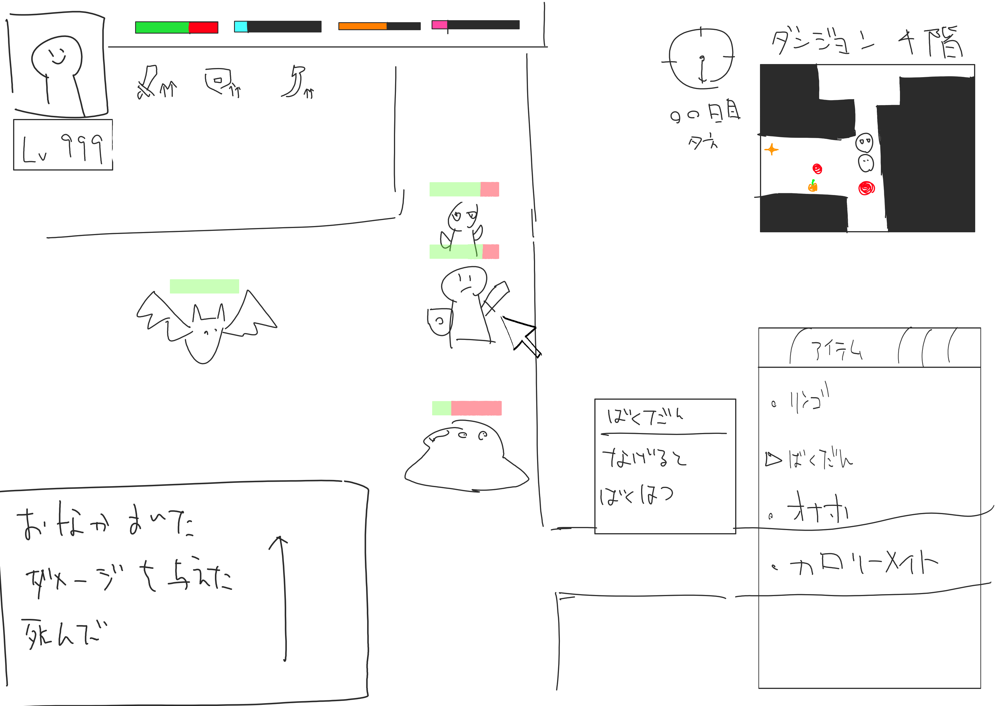
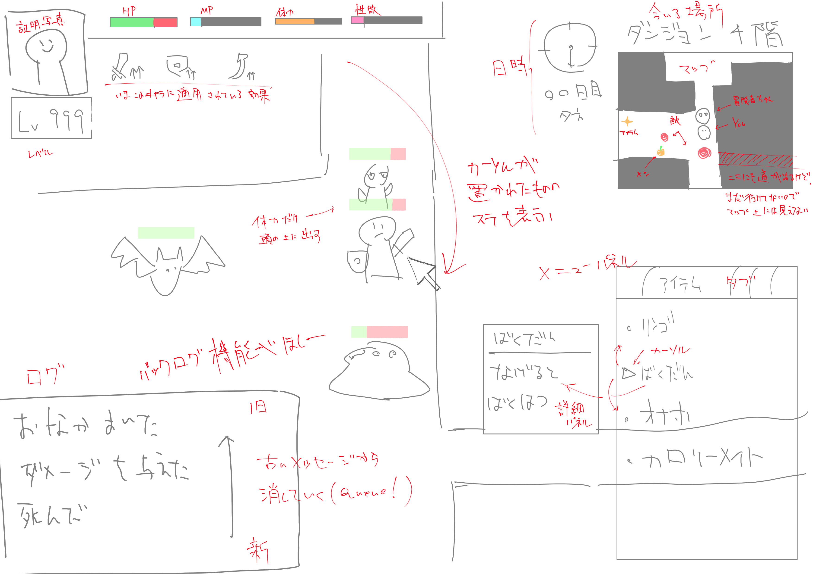

## 2024.10.03(木)

「冒険者ちゃん」の企画書を書き進めた。イメージは一切できてないけど、文章はいろいろ書けたので、最後に ChatGPT に見せて FB をもらった。

[ゲーム企画評価と提案](https://chatgpt.com/share/66fe4b0d-49ec-800c-9ec3-44eda097a1d4)

エロはまあいろいろ書いてあるとして、「ちゃんと遊べるゲーム」を作りたいなら、普通に遊ぶ部分もちゃんと作らなきゃねっていう真っ当な意見をもらえた。あいつやっぱ頭いいわ。

意見はまじで真っ当なので、次はゲームプレイの部分にフォーカスして、探索とエロのシステムを考え込もう。いい感じに考えたら新井くんにも見せて意見もらおう。キービジュは頑張って書きます……

あんまり上達しないようなら金だして書いてもらうのも視野に入れたほうがいいだろうな。売りに行くなら。\
でもそれ以前に、妹せいかつ → ファンタジー みたいに、一番やってみたい機能だけを開発した実験版を安売りしたほうがいいだろう。それで買い手がつくならこのまま作り込んでいいってなるし、開発資金も手に入るし。

## 2024.10.04(金)

今日はゲームシステム面について深堀りしていく回。

昨日もらった FB で、さっさと作って検証したほうがいいですよっていうのがあったので、街中探索かダンジョン探索の部分だけで実装したほうが良いかも。

ダンジョン探索しながら途中にハプニングがあってエロイベントが発生したりする感じで。

でもそれだとラッキースケベしかできないから、プレイヤーの意思でえっちするためには常にコマンドを実行できるような形にしたほうがいいかもな。となると原作ローグしかり、不思議のダンジョンしかりか？

となると、ほぼほぼ MISTOVER って言おうとしたら MISTOVER 配信終了しててどこにも無かった……ゲームソフトって消えることあるんだね……じゃあ darkest dungeon。

Unity 上でグリッド移動をどういう風に実装したらいいのか調べた結果、チュートリアルくんに出会った。英語嫌いだけどこいつやるのが多分一番早いです。やれ。

[2D Roguelike - Unity Learn](https://learn.unity.com/project/2d-roguelike-tutorial)

ローグライクの神いた。
[ローグライクを作ったので開発手順をまとめてみた #HaxeFlixel](https://qiita.com/2dgames_jp/items/1730e7c4822091c3c320)

明日はローグライクの神に従ってゲーム構築してみようかな

## 2024.10.12(土)
設計しますかぁ。設計しないと実装なんかできないって先生も言ってた。

今日はUMLでパラメータ関係を中心に、全体の設計をした。なんかデカくなりすぎたし、パッケージ分けしてUML書き直したほうがいいかもね

## 2024.10.16(水)
設計をあらかた作ったはずなので、それに従ってスクリプトを組んでいく。途中足りないものとかも分かってくるはずなので、適宜設計を見直しながら反映していきたい。

こうやって分割してみるとつくるもん多いな。てかいまの技量では作れなさそう。これは分割したほうがいいです。

今後の制作段階は
1. バラバラにゲームシステムをつくる
	1. ローグライク 
	2. おさわりゲー
	3. ADV
2. 作ったシステムを統合する

この量を一度につくるにはわからないことが多すぎて、完成する前に多分モチベが尽きる。1ヶ月毎に1ゲームシステム作るくらいのノリで作っていって、最終的にフェーズ2を目指そう。

でけえの作ろうとするなってのは、多くのインディーゲー開発者が言ってることだしね。

### 次回予定
2Dローグライクに添付されているスクリプトを読み込んで、ローグライク関連のゲームシステムを組めるようにする。

## 2024.10.17(木)
ローグライクをつくる。といっても、先駆者はローグライクつくるだけでも400時間くらいかかってるんだけどね。

ローグライクの神が残したメッセージに従い、ビューと画面移動から実装する。

ビューはこう
 

これで作ってみる。じゃあまた次回。